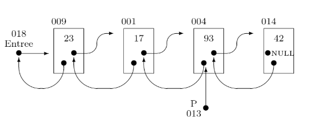
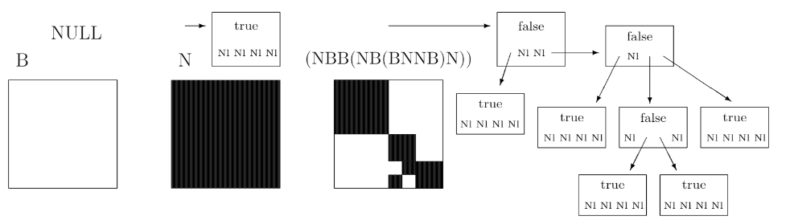

# Projet-Algo
Projet pour la matière Algorithmique de L3 Info.

Le but de ce projet est d'utiliser la récursivité, les pointeurs et le passage par adresse pour résoudre des problèmes algorithmiques.
Les différentes questions traites de listes chainées et de QuadTrees.

`2022` - `C`, `Algo`, `Optimisation`, `VisualStudioCode`

Pour obtenir plus d'informations sur ce projet n'hésitez à consulter le sujet : [Sujet](https://github.com/Julien-LG/Projet-Algo/blob/master/Sujet.pdf)

### Exemple de Liste Chainée

### Exemple de QuadTrees

## Conclusion
J'ai pour ce projet réalisé en monôme obtenu la note de 18.85/20.
